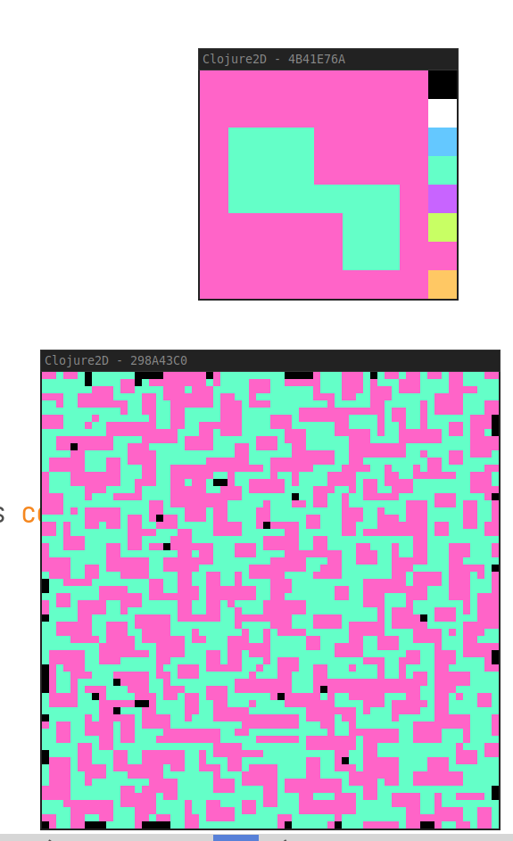

# Wave Function Collapse (texture)

Clojure 2D implementation of the Texture-based Wavetable Function Collapse
algorithm, as used by Caves of Qud and other games for generating levels.

Has a known issue but already makes some cool results

